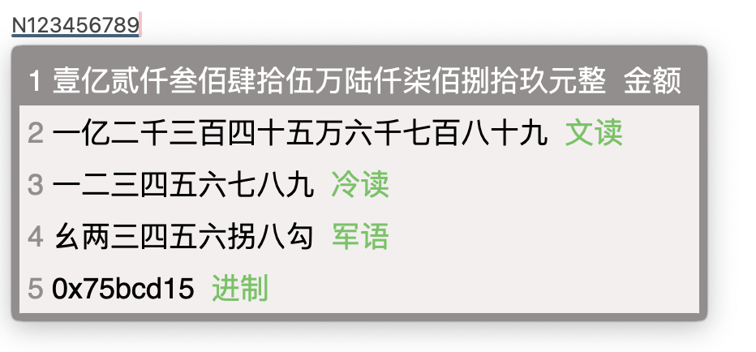

# RIME输入法配置

## 前言
RIME是一个很难上手的输入法，但是一旦配置完成，就可以放心无忧的一直使用。我已经不记得是几年前开始用了，经过这么几年不断的打磨，现在基本算用得比较顺手了。本仓库的配置基于其他网友的公开的方案，因为时间过长已经不记得出处了，无法一一道谢，还请见谅。

## 配置功能

### 输入法
- 86版五笔
- Luna拼音
- easy-en

### 特性
主力输入法是五笔，所以基本上置备都是在这个上面。以下是一些主要的功能：
- 中英文混输

- 按z键用拼音反查五笔编码

- 自动造词

- 键入`/`开始符号输入模式，具体的符号代码可以查阅`symbols.yaml`

- 键入`time`输入时间

- 键入`date`输入日期

- 键入`week`输入日期+星期

- 键入`dttm`输入日期时间的字符串，有时候命名文件的时候会用到

- 键入`N`然后输入数字输出大写数字

- 键入`R`然后字符和数字进行字符乘法，比如`R-5`或者`R5-`都会输出`-----`

- 键入`F`然后输入会调用`figlet`来输出字符画，比如`FRIME`会输出：

不过这个需要在等宽字体的情况下才能正常显示，所以几乎也没有什么鸟用。
- 键入D然后输入日期，比如`D2019-01-01`会输出`2019年1月1日`，设计这个主要是因为用五笔输入月和日都要按好几下才能出来。

- 键入C开始计算器模式，比如键入`C35*7`会出来`35*7=245`和`245`这两个选项。

- 键入W开启微信表情输入模式，这个可能是用lua自定义的功能里面用得最多的了。
以下是表情与符号的对照表，基本上是拼音首字母的缩写，有重复的时候会进行一些区别。可以加上数字来控制表情输出的个数，如果不输入表情代码，会随机选择。比如`W5`会输出`[瓢虫][凋谢][社会社会][咖啡][合十]`。这个聊天的时候挺常用。

| 表情 | 含义 | 表情 | 含义 | 表情 | 含义 |
| --- | --- | --- | --- | --- | --- |
|am|傲慢| an|爱你 |aq|爱情|
|ax|爱心 |bb|便便| bq|抱拳|
|bs|鄙视 |by|白眼| bz|爆竹|
|bzu|闭嘴 |cd|菜刀| cg|吃瓜|
|ch|擦汗 |cj|差劲| cy|呲牙|
|d|刀 |dg|蛋糕| dk|大哭|
|dl|打脸 |dx|凋谢| dy|得意|
|f|饭 |fa|發| fby|翻白眼|
|fd|发呆 |fdo|奋斗| fdou|发抖|
|fl|疯了 |fn|发怒| fw|飞吻|
|gg|尴尬 |gy|勾引| gz|鼓掌|
|h|汗 |hb|红包| hd|好的|
|hh|嘿哈 |hq|哈欠| hs|合十|
|ht|回头 |hx|坏笑| hxi|憨笑|
|hxiu|害羞 |j|囧| je|饥饿|
|jk|惊恐 |jx|奸笑| jy|惊讶|
|jyo|加油 |jz|机智| kb|抠鼻|
|kf|咖啡 |kj|恐惧| kkl|快哭了|
|kl|可怜 |klo|骷髅| ks|苦涩|
|kt|磕头 |k|酷| ku|困|
|lh|流汗 |lha|冷汗| lho|脸红|
|lk|裂开 |ll|流泪| lll|666|
|lq|篮球 |lw|礼物| mg|玫瑰|
|ng|难过 |no|NO| oh|怄火|
|ok|OK |pc|瓢虫| pj|啤酒|
|pp|乒乓 |ptwx|破涕为笑| pz|撇嘴|
|q|强 |qd|敲打| qdl|糗大了|
|qq|亲亲 |qt|拳头| qz|庆祝|
|r|弱 |s|衰| sb|生病|
|sd|闪电 |se|色| sh|睡|
|shi|嘘 |shu|社会社会| sl|胜利|
|sw|失望 |t|吐| ta|天啊|
|tp|调皮 |tq|叹气| ts|跳绳|
|tt|跳跳 |tx|偷笑| txi|投降|
|ty|太阳 |w|哇| wc|旺柴|
|wl|捂脸 |wq|委屈| ws|握手|
|wx|微笑 |wy|无语| x|吓|
|xg|西瓜 |xl|笑脸| xs|心碎|
|y|耶 |yb|拥抱| yh|烟花|
|yhh|右哼哼 |yk|愉快| yl|月亮|
|yun|晕 |yw|疑问| yx|阴险|
|yxi|悠闲 |zc|嘴唇| zd|炸弹|
|zhh|左哼哼 |zj|再见| zk|抓狂|
|zm|咒骂 |zq|足球| zqu|转圈|
|zt|猪头|

- luna输入法几乎没有进行什么配置，就是下载了一个搜狗的词库，因为根本用不到拼音。

## TODO
用lua实现英文的模糊输入功能，比如键入`gdmn`则自动匹配`good morning`
